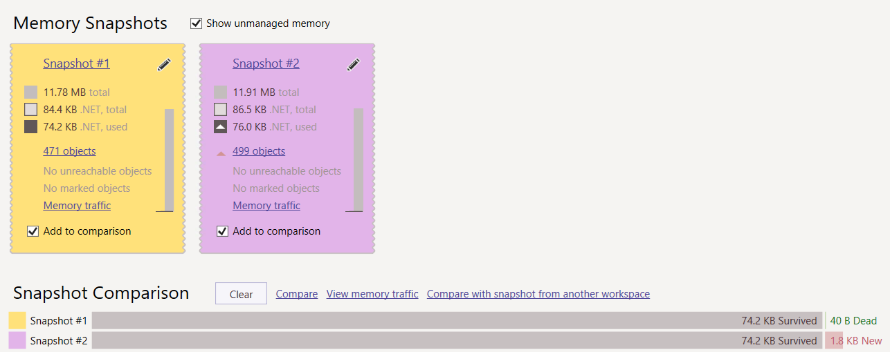
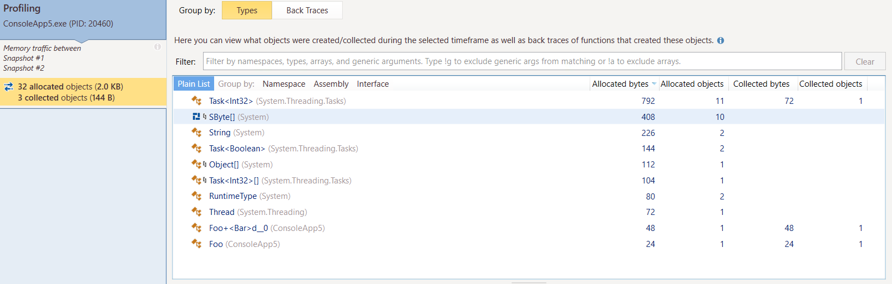
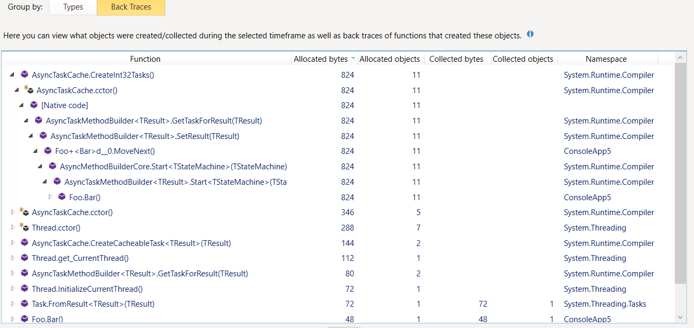

.net 5 ex.
```csharp
    class Foo
    {
        public async Task<int> Bar() => await Task.FromResult(1);
    }

    class Program
    {
        static int test() => new Foo().Bar().Result;

        static void Main(string[] args)
        {
            MemoryProfiler.CollectAllocations(true);
            MemoryProfiler.GetSnapshot();

            var r = test();

            MemoryProfiler.GetSnapshot();

            Console.WriteLine(r);
        }
    }
```





For code:
```csharp
    using System;
    using System.Threading.Tasks;

    class Foo
    {
        public async Task<int> Bar() => await Task.FromResult(1);
    }

    class Program
    {
        static int test() => new Foo().Bar().Result;

        static void Main(string[] args)
        {
            var r = test();

            Console.WriteLine(r);
        }
    }
```
will be generated code in the msill:
```csharp
using System;
using System.Diagnostics;
using System.Reflection;
using System.Runtime.CompilerServices;
using System.Security;
using System.Security.Permissions;
using System.Threading.Tasks;

[assembly: CompilationRelaxations(8)]
[assembly: RuntimeCompatibility(WrapNonExceptionThrows = true)]
[assembly: Debuggable(DebuggableAttribute.DebuggingModes.Default | DebuggableAttribute.DebuggingModes.DisableOptimizations | DebuggableAttribute.DebuggingModes.IgnoreSymbolStoreSequencePoints | DebuggableAttribute.DebuggingModes.EnableEditAndContinue)]
[assembly: SecurityPermission(SecurityAction.RequestMinimum, SkipVerification = true)]
[assembly: AssemblyVersion("0.0.0.0")]
[module: UnverifiableCode]
internal class Foo
{
    [CompilerGenerated]
    private sealed class <Bar>d__0 : IAsyncStateMachine
    {
        public int <>1__state;

        public AsyncTaskMethodBuilder<int> <>t__builder;

        public Foo <>4__this;

        private int <>s__1;

        private TaskAwaiter<int> <>u__1;

        private void MoveNext()
        {
            int num = <>1__state;
            int result;
            try
            {
                TaskAwaiter<int> awaiter;
                if (num != 0)
                {
                    awaiter = Task.FromResult(1).GetAwaiter();
                    if (!awaiter.IsCompleted)
                    {
                        num = (<>1__state = 0);
                        <>u__1 = awaiter;
                        <Bar>d__0 stateMachine = this;
                        <>t__builder.AwaitUnsafeOnCompleted(ref awaiter, ref stateMachine);
                        return;
                    }
                }
                else
                {
                    awaiter = <>u__1;
                    <>u__1 = default(TaskAwaiter<int>);
                    num = (<>1__state = -1);
                }
                <>s__1 = awaiter.GetResult();
                result = <>s__1;
            }
            catch (Exception exception)
            {
                <>1__state = -2;
                <>t__builder.SetException(exception);
                return;
            }
            <>1__state = -2;
            <>t__builder.SetResult(result);
        }

        void IAsyncStateMachine.MoveNext()
        {
            //ILSpy generated this explicit interface implementation from .override directive in MoveNext
            this.MoveNext();
        }

        [DebuggerHidden]
        private void SetStateMachine(IAsyncStateMachine stateMachine)
        {
        }

        void IAsyncStateMachine.SetStateMachine(IAsyncStateMachine stateMachine)
        {
            //ILSpy generated this explicit interface implementation from .override directive in SetStateMachine
            this.SetStateMachine(stateMachine);
        }
    }

    [AsyncStateMachine(typeof(<Bar>d__0))]
    [DebuggerStepThrough]
    public Task<int> Bar()
    {
        <Bar>d__0 stateMachine = new <Bar>d__0();
        stateMachine.<>4__this = this;
        stateMachine.<>t__builder = AsyncTaskMethodBuilder<int>.Create();
        stateMachine.<>1__state = -1;
        stateMachine.<>t__builder.Start(ref stateMachine);
        return stateMachine.<>t__builder.Task;
    }
}
internal class Program
{
    private static int test()
    {
        return new Foo().Bar().Result;
    }

    private static void Main(string[] args)
    {
        int value = test();
        Console.WriteLine(value);
    }
}
```